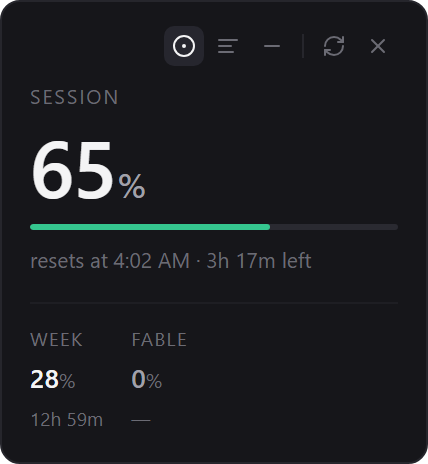
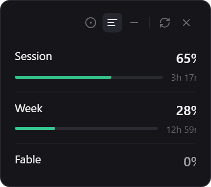
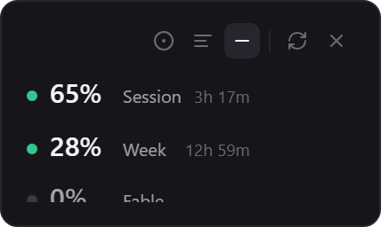
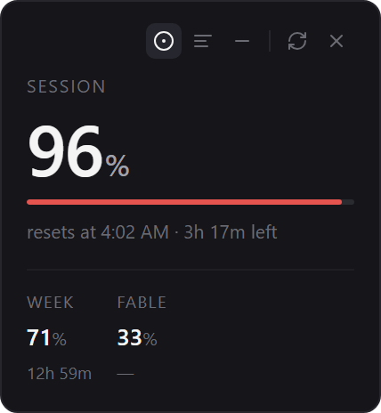
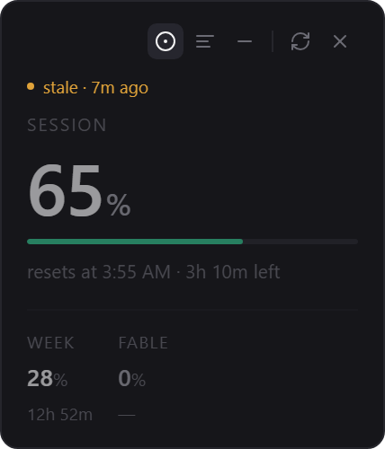
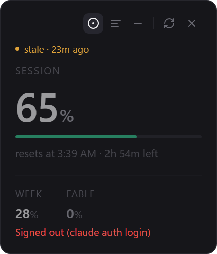

# Claude Usage Widget

A small desktop widget that keeps your Claude Code usage visible: session and
weekly windows, when they reset, and — the part most tools get wrong — **how
fresh the number actually is**.

<p align="center">
  
</p>

On Windows the percentage also appears in the system tray. The widget can be
hidden and brought back from the tray icon.

---

## Three views

Switch from the buttons in the top right; the choice persists. The window
**fits its content** — it resizes itself when you change views.

| Focus | List | Strip |
|:---:|:---:|:---:|
|  |  |  |
| Session large, the rest below | Aligned columns | Smallest footprint |

The big number is **always the session window**. Picking "whichever is highest"
means that when the session resets, the weekly window quietly takes over and the
widget starts telling you about something else.

## It doesn't hide its own state

The point of this widget isn't showing a number. It's **not showing a wrong one.**

| | |
|:---:|:---:|
|  |  |
| Colour shifts near the threshold — but the percentage is always legible, colour never carries information on its own | If the data is old, it **says so**. It never presents a stale value as current |

<p align="center">
  
</p>

Every failure class gets its own wording: signed out · asked too often · response
unreadable. Never a generic "error", because what you should do next depends on
which one it is.

---

## Why it doesn't parse `/usage` output

This was the most expensive lesson in the project, and it may save you the same
afternoon.

The first version ran `claude -p "/usage"` and parsed the text. It looked like it
worked — until the widget showed **7%** while the real value was **22%**.

`claude --debug-file` gave it away:

```
fetchUtilization: GET /api/oauth/usage (attempt 1)
fetchUtilization: 200 after 1 attempt(s)
[ERROR] Usage fetch returned a fieldless or non-object body (in-band error)
```

Calling the endpoint directly returned **HTTP 429**. The chain was:

1. The widget polled the usage endpoint **once a minute**.
2. The endpoint rate-limited the account.
3. The CLI **swallowed the 429** — it received `200` with an empty body and
   silently printed a **20-minute-old cache** as if it were current.
4. The widget believed it. Nothing looked broken.

> **Two different limits.** What we hit was the *request rate limit* on the usage
> endpoint — how often you may ask for the number — not your *usage quota*.
> Asking for usage costs no tokens.

### How it works now

- Data is read **structurally** from `~/.claude.json > cachedUsageUtilization`
  (`limits[]`). No text parsing.
- Refresh goes **straight to** `GET /api/oauth/usage`. The status code is
  classified; a 429 is never swallowed, it turns into exponential backoff
  (capped at one hour).
- **The rule that matters:** a record's `at` field is *when the server produced
  the data*, not when we read it. Staleness is derived from that, so showing an
  old value as current isn't a bug you can hit — it's a code path that doesn't
  exist.
- Default interval is **5 minutes**. Usage percentages move over hours; polling
  every minute adds nothing and only hits the limit.

> ⚠️ `/api/oauth/usage` is **not a documented endpoint.** If Anthropic changes
> it, this app breaks. It is written to break loudly: when the response isn't
> what it expects, the widget says "unreadable" rather than inventing a number.

---

## Install

Build a Windows installer:

```bash
npm install
npm run dist:win
```

Output lands in `dist/`. The installer is per-user and needs no admin rights.

macOS and Linux targets are configured in `electron-builder.yml`: `LSUIElement`
keeps it out of the macOS dock, and Linux produces an AppImage only.

```bash
npm run dist:mac     # macOS only — electron-builder refuses to cross-build
npm run dist:linux
```

## Launch it with Claude Code

Add a `SessionStart` hook to `~/.claude/settings.json`:

```json
{
  "hooks": {
    "SessionStart": [
      {
        "matcher": "",
        "hooks": [
          { "type": "command", "command": "node \"<repo>/scripts/launch-widget.mjs\"" }
        ]
      }
    ]
  }
}
```

The launcher follows two rules: it **never blocks** (spawns detached and exits
immediately, so your session start isn't delayed) and it **fails quietly** (exit
code 0 even when the widget isn't installed). Running it twice is harmless — a
single-instance lock means a second launch just brings the existing widget
forward.

---

## Language

The interface is English by default and switches to Turkish when the system
locale is Turkish. There is no language setting — it follows the OS.

Translation coverage is enforced by the type system: `MESSAGES` is typed
`Record<Lang, Record<MessageKey, string>>`, so forgetting a key in one language
is a **compile error** rather than a string that silently falls back.

## Privacy

- The access token is read from `~/.claude/.credentials.json` **only to sign the
  request**. It is never stored, logged, or returned.
- Nothing is ever written under `~/.claude/` — that directory is read-only here.
- No telemetry. The only outbound request is to Anthropic's own usage endpoint.
- The local history file stores percentages and timestamps, nothing else.

## Platform status

| Platform | State |
|---|---|
| Windows | **Verified** — developed and used here |
| Linux | Partial — process detection was verified on real Ubuntu. Under Wayland dragging falls back to CSS and saved position can't be applied, so it opens at the primary display's top-right |
| macOS | **Written, never run.** Menu-bar behaviour and packaging are unverified |

Not overstating this table is deliberate.

## Development

```bash
npm run dev         # run the widget in development mode
npm test            # 529 tests
npm run typecheck
npm run build
```

The renderer also runs in a plain browser: in development, when `window.usageApi`
is absent a fake bridge is installed, and `?state=ok|stale|error|critical|loading|no-data`
plus `?lang=tr|en` let you walk through every state. A **PREVIEW** badge is shown
whenever the fake bridge is active, so stub data can't be mistaken for real.

The screenshots in this repository were taken through that bridge: the interface
is the real widget, the data is synthetic.

## Known limitations

- Depends on an undocumented endpoint (see above).
- The sustainable polling interval was never measured; 5 minutes is a cautious
  guess after getting rate-limited at 1 minute.
- macOS and Linux have not been run on real machines.
- The tray icon is invisible on some Linux desktops (GNOME without an
  extension). The app **probes for this**: when the tray can't be confirmed, the
  "hide to tray" option is disabled — otherwise the widget would be
  unrecoverable.

## License

MIT — see [LICENSE](LICENSE).

---

<sub>Source comments are in Turkish; the interface ships in English and Turkish.</sub>
